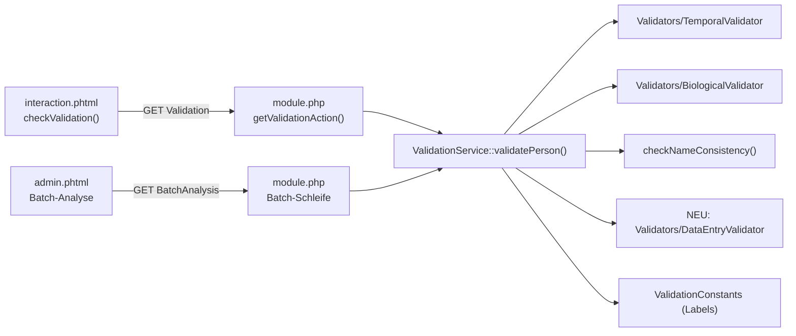

# Feature-Konzept: Erkennung von Eingabefehlern (Data-Entry-Checks)

## Release Overview (v1.6.11.0)

This update adds smart detection for common data entry and typo errors in webtrees forms and batch analysis:

- **Swapped Date and Place Fields**:
  - Warns if a place field contains standalone years, formatted dates, modifiers (e.g. `ca. 1880`), or month names with numbers.
  - Warns if a date field contains unexpected text or existing place names from your tree.
  - Safely ignores standard postal codes with city names (`1010 Wien`), calendar escapes, and date phrases in parentheses.

- **Capitalization Mistakes (ALL CAPS / lowercase)**:
  - Warns if given names or surnames are typed in ALL CAPS (e.g. `JOHANN`) or begin with lowercase letters (e.g. `johann`).
  - Supports name particles (`von`, `van der`, `de`), mixed prefixes (`McDonald`, `O'Brien`), initials (`J. H.`), Roman numerals, and non-cased scripts.

- **Suspicious Special Characters in Names**:
  - Warns about notes or symbols in names (`Johann (?)`, `Maria / Anna`, quotes `Johann "Hans"`).
  - **Preferred Name Support**: An asterisk `*` in given names (e.g. `Jonathan*`) is recognized as the webtrees Rufname marker and is explicitly allowed without warnings.
  - Suggests official GEDCOM placeholders (`@P.N.` / `@N.N.`) if informal placeholders like `?` or `unbekannt` are used.

- **Full Multilingual Support**:
  - All 17 new translation phrases are integrated across all 49 supported language files.

---

> Status: **In Umsetzung (Teil 1, 2 & 3 abgeschlossen)**
> - [x] **Feature A (Feld-Inhaltsvertauschung):** Vollständig implementiert & getestet (v1.6.11.0, Commit `4596c23`)
> - [x] **Feature B (Groß-/Kleinschreibung):** Vollständig implementiert & getestet (v1.6.11.0, Commit `e305447`)
> - [x] **Feature C (Verdächtige Sonderzeichen & Rufname `*`):** Vollständig implementiert & getestet (v1.6.11.0, Commit `ea89776`)
> - [x] **Übersetzungen:** Alle 49 Sprachdateien aktualisiert (v1.6.11.0, Commit `c843fc7`)
> Zielversion: 1.6.11.0
> Betroffene Bereiche: Live-Prüfung im Formular, Batch-Analyse, Ignorier-Funktion

---

## 1. Ziel

Drei neue Prüfungen für typische Tippfehler und Fehleingaben:

| # | Prüfung | Beispiel | Code(s) | Status |
|---|---------|----------|---------|--------|
| A | **Feld-Inhaltsvertauschung** | `PLAC: 1880`, `DATE: Hamburg` | `PLACE_CONTAINS_DATE`, `DATE_CONTAINS_TEXT` | ✅ **Erledigt (v1.6.11.0)** |
| B | **Groß-/Kleinschreibung** | `JOHANN`, `müller` | `NAME_ALL_CAPS`, `NAME_ALL_LOWERCASE` | ✅ **Erledigt (v1.6.11.0)** |
| C | **Verdächtige Sonderzeichen in Namen** | `Johann (?)`, `Maria / Anna`, `Peter*` (Rufname erlaubt) | `NAME_SUSPICIOUS_CHARS`, `NAME_PLACEHOLDER_HINT` | ✅ **Erledigt (v1.6.11.0)** |

---

## 2. Bestandsaufnahme (Ist-Zustand)

### 2.1 Relevante Architektur



- **Orchestrierung:** [`ValidationService::validatePerson()`](../src/Services/ValidationService.php) (Zeile ~85) ruft alle Prüfungen auf, filtert ignorierte Codes und ergänzt Labels.
- **Issue-Format** (überall identisch):
  ```php
  ['code' => 'XYZ', 'type' => 'xyz', 'label' => '...', 'severity' => 'error|warning|info', 'message' => '...']
  ```
- **Ignorieren** funktioniert automatisch über `code` (`IgnoredErrorService`) – keine Zusatzarbeit nötig.
- **Labels:** `ValidationConstants::$labels_de` / `$labels_en`.
- **Übersetzungen:** `resources/lang/*.php` (49 Dateien, Format `'English key' => 'Übersetzung'`).

### 2.2 Bereits vorhandene, verwandte Prüfungen

| Vorhanden | Ort | Abgrenzung zum neuen Feature |
|-----------|-----|------------------------------|
| `NAME_ENCODING_ISSUE` | `checkNameConsistency()` ~Z. 1503 | Nur Steuerzeichen `\x00-\x1F`. **Bleibt**, wird nicht ersetzt. |
| `NON_STANDARD_MONTH_NAME` | `checkInvalidMonths()` ~Z. 2444 | Nur ausgeschriebene Monatsnamen. Siehe Befund 2.3 b. |
| Präfix-Erkennung (`von`, `van der` …) | `checkNameConsistency()` ~Z. 1513 | Liefert die Partikel-Liste, die Prüfung B als Ausnahme braucht → **wiederverwenden**. |

### 2.3 Befunde bei der Analyse (vor Implementierung klären)

> [!WARNING]
> **a) Live-Prüfung überspringt viele Kategorien.**
> `getValidationAction()` ruft `validatePerson(..., [], $sex)` mit `$filters = []` auf.
> Da `$useFilters = ($filters !== null)` dann `true` ist, liefern alle `in_array(..., [])` `false`.
> Folge: Biologische, zeitliche und Ehe-Prüfungen laufen live **nicht**; nur Kategorien mit
> Settings-Fallback (`names`, `missing_data`, `geographic`, `sources`) greifen.
> → Bitte verifizieren, ob das gewollt ist. Für das neue Feature wird der Settings-Fallback
> (wie bei `names`) verwendet, damit es live unabhängig davon funktioniert.

> [!WARNING]
> **b) `checkInvalidMonths()` greift vermutlich nie.**
> Es wird `$fact->value()` geprüft – bei `BIRT/DEAT/...` ist das der Level-1-Wert (`Y` oder leer),
> nicht das Datum. Zudem wird nur geprüft, wenn `$date->isOK()` – ein Datum mit `Januar` ist für
> webtrees aber gerade *nicht* OK. Korrekt wäre `$fact->attribute('DATE')` ohne `isOK()`-Bedingung.
> → Kann im Zuge dieses Features mitbehoben werden (Prüfung A nutzt denselben Rohwert).

> [!CAUTION]
> **c) XSS-Risiko in der Live-Bubble.**
> `interaction.phtml` setzt `issue.message` per `innerHTML`. Prüfung C meldet gezielt Namen mit
> `<`, `>`, `"` usw. → Benutzereingaben in Meldungen **immer** mit `e()` / `htmlspecialchars()`
> escapen (siehe Abschnitt 6.4).

---

## 3. Fachliche Regeln

### 3.1 Prüfung A – Feld-Inhaltsvertauschung

#### A1: Datum im Ortsfeld (`PLACE_CONTAINS_DATE`)

Ort wird an Kommas in Bestandteile zerlegt (`Hamburg, Hamburg, Deutschland`). Gemeldet wird, wenn:

| Regel | Beispiel | Severity |
|-------|----------|----------|
| Ein Bestandteil ist **nur** eine Jahreszahl (3–4 Ziffern, 500–2099) | `1880`, `Hamburg, 1880` | warning |
| Ein Bestandteil enthält Monatsname/-kürzel **und** Zahl | `15 AUG 1890`, `Mai 1880` | warning |
| Ein Bestandteil beginnt mit GEDCOM-Modifier | `ABT 1880`, `BEF 1900` | warning |
| Bestandteil hat Datumsformat `dd.mm.yyyy`, `yyyy-mm-dd`, `dd/mm/yyyy` | `15.08.1890` | warning |

**Ausnahmen (kein Treffer):**
- Postleitzahlen im Kontext mit Text: `1010 Wien`, `20095 Hamburg` (Zahl + Wort im selben Bestandteil, ohne Monatsnamen).
- Hausnummern / Bezirke: `Berlin 12`, `Wien XIII`.
- Leere Orte.

> [!NOTE]
> Österreichische/Schweizer PLZ (4-stellig, 1000–9999) überschneiden sich mit Jahreszahlen.
> Deshalb wird eine **alleinstehende** 4-stellige Zahl nur gemeldet, wenn sie der **gesamte**
> Bestandteil ist. `1010 Wien` bleibt unauffällig, `Wien, 1880` wird gemeldet.

#### A2: Text im Datumsfeld (`DATE_CONTAINS_TEXT`)

Rohwert des `DATE`-Tags wird tokenisiert. Folgende Token sind **erlaubt** und werden entfernt:

- Zahlen (Tag, Jahr), `B.C.`, Doppeljahr `1720/21`
- GEDCOM-Monate: `JAN … DEC`, französisch `VEND … COMP`, hebräisch `TSH … ELL`
- Modifier: `ABT CAL EST AFT BEF BET AND FROM TO INT`
- Kalender-Escapes: `@#DGREGORIAN@`, `@#DJULIAN@`, `@#DHEBREW@`, `@#DFRENCH R@`
- Inhalt in Klammern `( … )` → GEDCOM-Datumsphrase, erlaubt (z. B. `INT 1880 (laut Kirchenbuch)`, `(unbekannt)`)

Bleiben danach **Wörter mit ≥ 3 Buchstaben** übrig → Meldung.

| Situation | Severity | Meldungsvariante |
|-----------|----------|------------------|
| Restwort entspricht einem existierenden Ort im Baum (`places.p_place`) | warning | „sieht aus wie ein Ort – Feld vertauscht?“ |
| Restwort ist ein bekannter, nicht-standardisierter Monatsname (`Januar`, `März`) | info | „Monatsname nicht GEDCOM-konform“ (= ersetzt faktisch `NON_STANDARD_MONTH_NAME`) |
| Sonstiges Restwort | warning | „Datum enthält nicht interpretierbaren Text“ |

**Geprüfte Fakten:** alle Personen-Fakten mit `DATE`/`PLAC` (`BIRT CHR BAPM DEAT BURI CREM RESI OCCU EDUC EMIG IMMI CENS …`) sowie Familien-Fakten der Ehen (`MARR DIV ENGA`) via `spouseFamilies()`.

### 3.2 Prüfung B – Groß-/Kleinschreibung

Geprüft werden **Vorname (GIVN)** und **Nachname (SURN)** jedes Namens (`getAllNames()` + Overrides).

| Code | Regel | Severity |
|------|-------|----------|
| `NAME_ALL_CAPS` | Alle Buchstaben groß, mindestens 3 Buchstaben | info |
| `NAME_ALL_LOWERCASE` | Erster Buchstabe jedes Wortes klein (außer Partikeln) | info |

**Ausnahmen (Pflicht):**
1. **Schriften ohne Groß-/Kleinschreibung** (CJK, Arabisch, Hebräisch, Georgisch …):
   Prüfung nur, wenn `mb_strtoupper($s) !== mb_strtolower($s)`.
2. **Partikel** klein erlaubt: `von, vom, zu, zur, van, de, den, der, het, ten, ter, da, do, dos, das, del, della, di, du, le, la, y, e, und, auf, aus, in` (Liste aus `checkNameConsistency()` übernehmen und als Konstante zentralisieren).
3. **Kurzformen:** Initialen (`J.`, `H.-P.`), römische Zahlen (`II`, `III`, `IV`), Wörter < 3 Buchstaben.
4. **Präfix-Schreibweisen:** `McDonald`, `MacLeod`, `O'Brien`, `d'Arcy`, `DeVries` sind *gemischt* → kein Treffer (nur „alles groß“ / „alles klein“ wird gemeldet).
5. **Platzhalter** `@N.N.`, `@P.N.` werden übersprungen.

> [!IMPORTANT]
> **Importierte GEDCOM-Dateien** enthalten Nachnamen häufig komplett in Großbuchstaben
> (`Johann /MÜLLER/` – Konvention vieler Programme). Ohne Schalter erzeugt die Batch-Analyse
> dann tausende Treffer. Deshalb:
> - Neue Einstellung `check_surname_caps` (Default **`0` = aus**).
> - Vornamen-CAPS (`check_given_caps`) Default **`1`**.

### 3.3 Prüfung C – Verdächtige Sonderzeichen in Namen

Geprüft werden GIVN und SURN (nicht der NAME-Rohwert, da dort `/` der Nachnamen-Begrenzer ist).

| Zeichen(gruppe) | Typische Ursache | Severity |
|-----------------|------------------|----------|
| `?` | Unsicherheit als Notiz (`Johann ?`) | warning |
| `( ) [ ] { }` | Notiz/Alternative (`Maria (Anna)`, `Johann [Hans]`) | warning |
| `/` `\` `|` | Alternativen (`Maria / Anna`) oder Rest des NAME-Begrenzers | warning |
| `"` `“ ” „` | Spitzname im Vornamen (`Johann "Hans"`) → Hinweis auf `NICK` | warning |
| `* # + ! = < > @ % & ; :` | Markierungen/Tippfehler | warning |
| Ziffern `0-9` | Notiz (`Johann 2`) oder Tippfehler | warning |

**Erlaubt:** Buchstaben inkl. Diakritika (`\p{L}`, `\p{M}`), Leerzeichen, Bindestrich `-`, Apostroph `'` `’`, Punkt `.` (Initialen), römische Zahlen.

**Zusatz `NAME_PLACEHOLDER_HINT` (info):** Vor- oder Nachname besteht nur aus `?`, `??`, `NN`, `N.N.`, `unbekannt`, `unknown`, `-`, `…`
→ Hinweis: „Unbekannte Namen in webtrees mit `@P.N.` (Vorname) bzw. `@N.N.` (Nachname) erfassen.“
Statt `NAME_SUSPICIOUS_CHARS` wird dann nur dieser Hinweis ausgegeben (keine Doppelmeldung).

**Meldungstext mit Vorschlag**, z. B.:
- `"Johann (?)"` → „Vorname enthält Notiz in Klammern. Unsicherheit besser als Notiz/Quelle erfassen.“
- `Johann "Hans"` → „Spitzname im Vornamen – bitte im Feld *Spitzname (NICK)* erfassen.“

---

## 4. Technisches Design

### 4.1 Neue Klasse `DataEntryValidator`

Datei: `src/Services/Validators/DataEntryValidator.php`

Aufteilung in **zwei Ebenen**:

1. **Reine String-Funktionen** (`public static`, ohne webtrees-Abhängigkeit) → einfach testbar:
   - `analyzePlace(string $place): ?string` – liefert Grund-Schlüssel oder `null`
   - `analyzeDate(string $rawDate): array` – `['leftover' => [...], 'nonStandardMonth' => bool]`
   - `analyzeCase(string $namePart): ?string` – `'caps' | 'lower' | null`
   - `analyzeSpecialChars(string $namePart): array` – gefundene Zeichengruppen
   - `isPlaceholderName(string $namePart): bool`
2. **Personen-Wrapper** (erzeugen Issues):
   - `checkFieldSwaps(?Individual $person, array $liveFields = [], ?Tree $tree = null): array`
   - `checkNameFormatting(?Individual $person, string $overrideGiven, string $overrideSurname, ?object $module): array`

### 4.2 Neue Kategorie & Einstellungen

| Schlüssel | Typ | Default | Zweck |
|-----------|-----|---------|-------|
| Filter-Kategorie `data_entry` | Batch-Filter | – | Kategorie in der Analyse |
| `enable_data_entry_checks` | Setting | `1` | Live-Prüfung aktiv |
| `analysis_cat_data_entry` | Setting | `1` | Checkbox-Vorbelegung Batch |
| `check_given_caps` | Setting | `1` | CAPS bei Vornamen |
| `check_surname_caps` | Setting | `0` | CAPS bei Nachnamen (Import-Problem) |

> [!IMPORTANT]
> Die zusätzlichen Checkboxen in `admin.phtml` (Kategorie + 2 Schalter) sind **UI-Änderungen**
> und werden erst nach Freigabe des Layouts eingebaut. Vorschlag: neue Checkbox direkt unter
> „Check GEDCOM“ (Zeile ~589), Schalter im Tab „Plausibilität“.

### 4.3 Datenfluss Live-Prüfung

Die Live-Prüfung übergibt aktuell **keine Ortsfelder**. Erweiterung:

- Frontend sammelt alle sichtbaren `DATE`- und `PLAC`-Felder des Formulars:
  `[{ "tag": "BIRT", "field": "DATE", "value": "Hamburg" }, …]`
- Übergabe als neuer Parameter `fields` (JSON, URL-encodiert).
- `getValidationAction()` dekodiert und reicht an `validatePerson()` weiter.

---

## 5. Programmieranleitung (Schritt für Schritt)

### Schritt 1 – Labels in `ValidationConstants.php`

```php
// $labels_de
'PLACE_CONTAINS_DATE'    => 'Datum im Ortsfeld',
'DATE_CONTAINS_TEXT'     => 'Text im Datumsfeld',
'NAME_ALL_CAPS'          => 'Name komplett in Großbuchstaben',
'NAME_ALL_LOWERCASE'     => 'Name in Kleinbuchstaben',
'NAME_SUSPICIOUS_CHARS'  => 'Verdächtige Zeichen im Namen',
'NAME_PLACEHOLDER_HINT'  => 'Platzhalter für unbekannten Namen',

// $labels_en
'PLACE_CONTAINS_DATE'    => 'Date in place field',
'DATE_CONTAINS_TEXT'     => 'Text in date field',
'NAME_ALL_CAPS'          => 'Name in all capitals',
'NAME_ALL_LOWERCASE'     => 'Name in lowercase',
'NAME_SUSPICIOUS_CHARS'  => 'Suspicious characters in name',
'NAME_PLACEHOLDER_HINT'  => 'Placeholder for unknown name',
```

### Schritt 2 – Validator anlegen

```php
<?php

namespace Wolfrum\Datencheck\Services\Validators;

use Fisharebest\Webtrees\Individual;
use Fisharebest\Webtrees\Tree;
use Illuminate\Database\Capsule\Manager as DB;

class DataEntryValidator extends AbstractValidator
{
    /** Kleingeschriebene Namenspartikel (zentral, auch für checkNameConsistency nutzbar) */
    public const NAME_PARTICLES = [
        'von', 'vom', 'zu', 'zur', 'van', 'de', 'den', 'der', 'het', 'ten', 'ter',
        'da', 'do', 'dos', 'das', 'del', 'della', 'di', 'du', 'le', 'la', 'y', 'e',
        'und', 'auf', 'aus', 'in', "'t",
    ];

    private const GEDCOM_MONTHS = [
        'JAN','FEB','MAR','APR','MAY','JUN','JUL','AUG','SEP','OCT','NOV','DEC',
        'VEND','BRUM','FRIM','NIVO','PLUV','VENT','GERM','FLOR','PRAI','MESS','THER','FRUC','COMP',
        'TSH','CSH','KSL','TVT','SHV','ADR','ADS','NSN','IYR','SVN','TMZ','AAV','ELL',
    ];

    private const GEDCOM_KEYWORDS = ['ABT','CAL','EST','AFT','BEF','BET','AND','FROM','TO','INT','B.C.','BC'];

    private const PLACEHOLDERS = ['?', '??', '???', 'nn', 'n.n.', 'n. n.', 'unbekannt', 'unknown', '-', '...', '…'];

    // ---------------------------------------------------------------------
    // Ebene 1: reine String-Analyse
    // ---------------------------------------------------------------------

    /**
     * @return string|null 'year' | 'date' | 'modifier' | null
     */
    public static function analyzePlace(string $place): ?string
    {
        foreach (array_map('trim', explode(',', $place)) as $part) {
            if ($part === '') {
                continue;
            }
            // Bestandteil ist ausschließlich eine Jahreszahl
            if (preg_match('/^\d{3,4}$/', $part) && (int) $part >= 500 && (int) $part <= 2099) {
                return 'year';
            }
            // Numerische Datumsformate
            if (preg_match('/^\d{1,2}[.\/-]\d{1,2}[.\/-]\d{2,4}$|^\d{4}-\d{1,2}-\d{1,2}$/', $part)) {
                return 'date';
            }
            $upper = mb_strtoupper($part, 'UTF-8');
            // GEDCOM-Modifier am Anfang + Zahl
            if (preg_match('/^(ABT|CAL|EST|AFT|BEF|BET|FROM|TO)\s+\d/', $upper)) {
                return 'modifier';
            }
            // Monatsname + Zahl
            if (preg_match('/\d/', $part)) {
                foreach (preg_split('/[\s.]+/u', $part) as $token) {
                    if (self::isMonthToken($token)) {
                        return 'date';
                    }
                }
            }
        }
        return null;
    }

    /**
     * @return array{leftover: string[], nonStandardMonth: bool}
     */
    public static function analyzeDate(string $rawDate): array
    {
        $s = preg_replace('/@#D[A-Z ]+@/', ' ', $rawDate);   // Kalender-Escapes
        $s = preg_replace('/\([^)]*\)/u', ' ', $s);         // Datumsphrasen
        $tokens = preg_split('/[\s\/.,-]+/u', trim((string) $s), -1, PREG_SPLIT_NO_EMPTY);

        $leftover = [];
        $nonStandardMonth = false;
        foreach ($tokens as $t) {
            $u = mb_strtoupper($t, 'UTF-8');
            if (ctype_digit($t) || in_array($u, self::GEDCOM_MONTHS, true) || in_array($u, self::GEDCOM_KEYWORDS, true)) {
                continue;
            }
            if (self::isMonthToken($t)) {          // Januar, März, January …
                $nonStandardMonth = true;
                continue;
            }
            if (mb_strlen($t) >= 3 && preg_match('/\p{L}/u', $t)) {
                $leftover[] = $t;
            }
        }
        return ['leftover' => $leftover, 'nonStandardMonth' => $nonStandardMonth];
    }

    /** @return 'caps'|'lower'|null */
    public static function analyzeCase(string $namePart): ?string
    {
        $namePart = trim($namePart);
        if ($namePart === '' || str_starts_with($namePart, '@')) {
            return null;
        }
        // Schrift ohne Groß-/Kleinschreibung
        if (mb_strtoupper($namePart, 'UTF-8') === mb_strtolower($namePart, 'UTF-8')) {
            return null;
        }

        $words = array_filter(preg_split('/[\s-]+/u', $namePart), static function (string $w): bool {
            $l = mb_strtolower($w, 'UTF-8');
            return mb_strlen(preg_replace('/[^\p{L}]/u', '', $w)) >= 3          // kurze Wörter/Initialen
                && !in_array($l, self::NAME_PARTICLES, true)                     // Partikel
                && !preg_match('/^[IVXLCDM]+$/', $w);                            // römische Zahlen
        });
        if (empty($words)) {
            return null;
        }

        $letters = preg_replace('/[^\p{L}]/u', '', implode('', $words));
        if (mb_strlen($letters) >= 3 && $letters === mb_strtoupper($letters, 'UTF-8')) {
            return 'caps';
        }
        foreach ($words as $w) {
            $first = mb_substr(preg_replace('/^[^\p{L}]+/u', '', $w), 0, 1);
            if ($first !== mb_strtolower($first, 'UTF-8')) {
                return null;   // mindestens ein Wort korrekt groß → kein Treffer
            }
        }
        return 'lower';
    }

    /** @return string[] gefundene Zeichengruppen, z. B. ['brackets', 'question'] */
    public static function analyzeSpecialChars(string $namePart): array
    {
        $groups = [
            'question' => '/\?/u',
            'brackets' => '/[()\[\]{}]/u',
            'slash'    => '/[\/\\\\|]/u',
            'quotes'   => '/["“”„«»]/u',
            'digits'   => '/\d/u',
            'symbols'  => '/[*#+!=<>@%&;:]/u',
        ];
        if (str_starts_with(trim($namePart), '@')) {
            return [];   // @N.N. / @P.N.
        }
        $found = [];
        foreach ($groups as $key => $regex) {
            if (preg_match($regex, $namePart)) {
                $found[] = $key;
            }
        }
        return $found;
    }

    public static function isPlaceholderName(string $namePart): bool
    {
        return in_array(mb_strtolower(trim($namePart), 'UTF-8'), self::PLACEHOLDERS, true);
    }

    private static function isMonthToken(string $token): bool
    {
        // DateParser::MONTH_MAP ist private → öffentliche Hilfsmethode ergänzen:
        // DateParser::isMonthName(string $token): bool (ohne reine Zahlen!)
        return \Wolfrum\Datencheck\Helpers\DateParser::isMonthName($token);
    }

    // ---------------------------------------------------------------------
    // Ebene 2: Issues für Personen erzeugen
    // ---------------------------------------------------------------------

    /**
     * @param array<int, array{tag:string, field:string, value:string}> $liveFields
     */
    public static function checkFieldSwaps(?Individual $person, array $liveFields = [], ?Tree $tree = null): array
    {
        $entries = $liveFields;

        if ($person) {
            $facts = $person->facts();
            foreach ($person->spouseFamilies() as $family) {
                $facts = $facts->merge($family->facts(['MARR', 'DIV', 'ENGA', 'MARB', 'MARC']));
            }
            foreach ($facts as $fact) {
                $date = (string) $fact->attribute('DATE');
                $plac = (string) $fact->attribute('PLAC');
                if ($date !== '') $entries[] = ['tag' => $fact->tag(), 'field' => 'DATE', 'value' => $date, 'label' => $fact->label()];
                if ($plac !== '') $entries[] = ['tag' => $fact->tag(), 'field' => 'PLAC', 'value' => $plac, 'label' => $fact->label()];
            }
        }

        $issues = [];
        $seen   = [];
        foreach ($entries as $e) {
            $key = $e['field'] . '|' . $e['value'];
            if (isset($seen[$key])) continue;      // Live + gespeichert nicht doppelt melden
            $seen[$key] = true;

            $label = e($e['label'] ?? $e['tag']);
            $value = e($e['value']);

            if ($e['field'] === 'PLAC' && self::analyzePlace($e['value']) !== null) {
                $issues[] = self::issue('PLACE_CONTAINS_DATE', 'warning',
                    self::translate('Place of %s contains a date or year: "%s". Were date and place swapped?', $label, $value));
            }

            if ($e['field'] === 'DATE') {
                $res = self::analyzeDate($e['value']);
                if (!empty($res['leftover'])) {
                    $looksLikePlace = $tree && self::existsAsPlace($tree, $res['leftover']);
                    $issues[] = self::issue('DATE_CONTAINS_TEXT', 'warning', $looksLikePlace
                        ? self::translate('Date of %s contains a place name: "%s". Were date and place swapped?', $label, $value)
                        : self::translate('Date of %s contains text that cannot be interpreted: "%s".', $label, $value));
                } elseif ($res['nonStandardMonth']) {
                    $issues[] = self::issue('NON_STANDARD_MONTH_NAME', 'info',
                        self::translate('Non-standard month name found in %s: "%s". Expected GEDCOM standard (e.g. JAN, FEB).', $label, $value));
                }
            }
        }
        return $issues;
    }

    private static function existsAsPlace(Tree $tree, array $words): bool
    {
        // Ein Query pro Prüfung, nur auf indexierte Spalte; kein LIKE '%…%'
        return DB::table('places')
            ->where('p_file', '=', $tree->id())
            ->whereIn('p_place', $words)
            ->exists();
    }

    private static function issue(string $code, string $severity, string $message): array
    {
        return [
            'code'     => $code,
            'type'     => 'data_entry',
            'severity' => $severity,
            'message'  => $message,
        ];
    }
}
```

> [!TIP]
> `label` wird nicht gesetzt – `validatePerson()` ergänzt es automatisch aus `ValidationConstants`.

`checkNameFormatting()` folgt demselben Muster:

```php
public static function checkNameFormatting(?Individual $person, string $overrideGiven = '', string $overrideSurname = '', ?object $module = null): array
{
    $checkGivenCaps   = !$module || $module->getSetting('check_given_caps', '1') === '1';
    $checkSurnameCaps =  $module && $module->getSetting('check_surname_caps', '0') === '1';

    // 1. Namenspaare sammeln: gespeicherte Namen + Live-Overrides (pipe-separiert, wie in checkNameConsistency)
    $pairs = [];
    foreach ($person ? $person->getAllNames() : [] as $n) {
        $pairs[] = [$n['givn'] ?? '', $n['surn'] ?? ''];
    }
    $g = explode('|', $overrideGiven);
    $s = explode('|', $overrideSurname);
    foreach ($g as $i => $given) {
        $pairs[] = [trim($given), trim($s[$i] ?? '')];
    }

    $issues = [];
    $seen   = [];
    foreach ($pairs as [$given, $surname]) {
        foreach (['given' => $given, 'surname' => $surname] as $part => $value) {
            if ($value === '' || isset($seen[$part . $value])) continue;
            $seen[$part . $value] = true;
            $v = e($value);

            // a) Platzhalter hat Vorrang vor Sonderzeichen
            if (self::isPlaceholderName($value)) {
                $issues[] = self::issue('NAME_PLACEHOLDER_HINT', 'info', $part === 'given'
                    ? self::translate('Unknown given name "%s": please use the placeholder @P.N.', $v)
                    : self::translate('Unknown surname "%s": please use the placeholder @N.N.', $v));
                continue;
            }

            // b) Sonderzeichen
            $chars = self::analyzeSpecialChars($value);
            if (!empty($chars)) {
                $hint = in_array('quotes', $chars, true)
                    ? self::translate('Nicknames belong in the nickname field (NICK).')
                    : self::translate('Notes or uncertainties should be recorded as a note or source.');
                $issues[] = self::issue('NAME_SUSPICIOUS_CHARS', 'warning',
                    self::translate('Name "%s" contains suspicious characters.', $v) . ' ' . $hint);
            }

            // c) Groß-/Kleinschreibung
            $case = self::analyzeCase($value);
            if ($case === 'caps' && (($part === 'given' && $checkGivenCaps) || ($part === 'surname' && $checkSurnameCaps))) {
                $issues[] = self::issue('NAME_ALL_CAPS', 'info',
                    self::translate('Name "%s" is written entirely in capital letters.', $v));
            } elseif ($case === 'lower') {
                $issues[] = self::issue('NAME_ALL_LOWERCASE', 'info',
                    self::translate('Name "%s" begins with a lowercase letter.', $v));
            }
        }
    }
    return $issues;
}
```

### Schritt 3 – `DateParser::isMonthName()` ergänzen

```php
/** Liefert true für Monatsnamen/-kürzel (nicht für Zahlen). */
public static function isMonthName(string $token): bool
{
    $l = mb_strtolower(trim($token, " .\t"), 'UTF-8');
    return $l !== '' && !ctype_digit($l) && isset(self::MONTH_MAP[$l]);
}
```

Optional `MONTH_MAP` um weitere Sprachen erweitern (`janvier`, `enero`, `gennaio`, `januari` …), da das Modul 49 Sprachen unterstützt.

### Schritt 4 – Einbindung in `ValidationService::validatePerson()`

Neuer Block nach „Multiple Tags“ (Zeile ~183), **außerhalb** von `if ($person)`, damit auch Neuanlagen geprüft werden:

```php
// 4b. Data entry errors (field swaps, capitalization, special characters)
if (!$useFilters || in_array('data_entry', $filters) || self::getModuleSetting($module, 'enable_data_entry_checks', '1') === '1') {
    $issues = array_merge($issues, Validators\DataEntryValidator::checkFieldSwaps($person, $liveFields, $tree));
    $issues = array_merge($issues, Validators\DataEntryValidator::checkNameFormatting($person, $overrideGiven, $overrideSurname, $module));
}
```

Signatur von `validatePerson()` um **letzten, optionalen** Parameter erweitern (keine Brüche für bestehende Aufrufe):

```php
string $overrideSex = '',
array $liveFields = []
```

> [!NOTE]
> Bei aktiver Batch-Filterung **ohne** `data_entry` greift trotzdem der Settings-Fallback
> (gleiches Verhalten wie bei `names`). Soll die Batch-Kategorie strikt gelten, die Bedingung
> auf `(!$useFilters && setting) || in_array('data_entry', $filters)` ändern – fachlich zu entscheiden.

Optional: `checkInvalidMonths()` entfernen bzw. auf `analyzeDate()` umstellen (Befund 2.3 b), damit `NON_STANDARD_MONTH_NAME` nicht doppelt gemeldet wird.

### Schritt 5 – Endpunkt `getValidationAction()` (module.php)

```php
$liveFields = [];
$rawFields  = $params['fields'] ?? '';
if ($rawFields !== '') {
    $decoded = json_decode($rawFields, true);
    if (is_array($decoded)) {
        foreach (array_slice($decoded, 0, 50) as $f) {           // Größenbegrenzung
            if (!isset($f['tag'], $f['field'], $f['value'])) continue;
            if (!in_array($f['field'], ['DATE', 'PLAC'], true)) continue;
            $liveFields[] = [
                'tag'   => preg_replace('/[^A-Z_]/', '', strtoupper((string) $f['tag'])),
                'field' => $f['field'],
                'value' => mb_substr(trim((string) $f['value']), 0, 255),
            ];
        }
    }
}

$result = ValidationService::validatePerson(
    $person, $this, $birth, $death, $burial, $husb, $wife, $fam, $tree,
    $marrFormatted, $relType, $given, $surname, $bap, [], $sex, $liveFields
);
```

### Schritt 6 – Frontend `interaction.phtml` → `checkValidation()`

Vor dem Aufbau der URL (Zeile ~1972) Felder einsammeln:

```javascript
// Collect visible DATE and PLAC inputs for data-entry checks
const liveFields = [];
allElements.forEach(el => {
    if (el.offsetParent === null || el.type === 'hidden') return;
    const key = ((el.id || "") + " " + (el.name || "")).toUpperCase();
    const value = (el.value || "").trim();
    if (!value || value.toUpperCase() === 'Y') return;
    const field = /(^|[^A-Z])DATE([^A-Z]|$)/.test(key) ? 'DATE'
                : /(^|[^A-Z])PLAC([^A-Z]|$)/.test(key) ? 'PLAC' : null;
    if (!field) return;
    const tagMatch = key.match(/(?:INDI|FAM)-([A-Z_]+)-(?:DATE|PLAC)/);
    liveFields.push({ tag: tagMatch ? tagMatch[1] : '', field: field, value: value.substring(0, 255) });
});
```

URL ergänzen:

```javascript
"&fields=" + encodeURIComponent(JSON.stringify(liveFields.slice(0, 50))) +
```

Zusätzlich die Trigger in `handleInput` / `change`-Listener um `PLAC` erweitern, damit die Prüfung auch beim Tippen im Ortsfeld startet (aktuell nur `DATE`, Namen, `SEX`).

### Schritt 7 – Übersetzungen

Neue englische Schlüssel (Meldungen aus Schritt 2) in **alle 49** `resources/lang/*.php` eintragen. Mindestumfang `de.php`:

```php
// Data entry checks
'Place of %s contains a date or year: "%s". Were date and place swapped?' => 'Ort bei %s enthält ein Datum oder Jahr: „%s“. Wurden Datum und Ort vertauscht?',
'Date of %s contains a place name: "%s". Were date and place swapped?'   => 'Datum bei %s enthält einen Ortsnamen: „%s“. Wurden Datum und Ort vertauscht?',
'Date of %s contains text that cannot be interpreted: "%s".'             => 'Datum bei %s enthält nicht interpretierbaren Text: „%s“.',
'Name "%s" is written entirely in capital letters.'                      => 'Name „%s“ ist komplett in Großbuchstaben geschrieben.',
'Name "%s" begins with a lowercase letter.'                              => 'Name „%s“ beginnt mit einem Kleinbuchstaben.',
'Name "%s" contains suspicious characters.'                              => 'Name „%s“ enthält verdächtige Zeichen.',
'Nicknames belong in the nickname field (NICK).'                         => 'Spitznamen gehören in das Feld „Spitzname“ (NICK).',
'Notes or uncertainties should be recorded as a note or source.'         => 'Anmerkungen oder Unsicherheiten bitte als Notiz oder Quelle erfassen.',
'Unknown given name "%s": please use the placeholder @P.N.'              => 'Unbekannter Vorname „%s“: bitte den Platzhalter @P.N. verwenden.',
'Unknown surname "%s": please use the placeholder @N.N.'                 => 'Unbekannter Nachname „%s“: bitte den Platzhalter @N.N. verwenden.',
'Data Entry Errors'                                                      => 'Eingabefehler',
'Check capitalization of given names'                                    => 'Groß-/Kleinschreibung bei Vornamen prüfen',
'Check capitalization of surnames (disable for GEDCOM imports with uppercase surnames)' => 'Groß-/Kleinschreibung bei Nachnamen prüfen (bei GEDCOM-Importen mit Großbuchstaben deaktivieren)',
```

### Schritt 8 – Admin-UI (erst nach Freigabe)

- `admin.phtml`: Checkbox `value="data_entry"` / `id="chk_data_entry"` unter „Check GEDCOM“.
- Einstellungen-Tab: Schalter `check_given_caps`, `check_surname_caps`, `enable_data_entry_checks`.
- `module.php` → `postAdminAction()`: neue Settings speichern (analog zu `analysis_cat_gedcom`).

---

## 6. Qualität & Randfälle

### 6.1 Testmatrix (Unit-Tests für Ebene 1)

| Funktion | Eingabe | Erwartet |
|----------|---------|----------|
| `analyzePlace` | `1880` | `year` |
| `analyzePlace` | `Hamburg, 1880` | `year` |
| `analyzePlace` | `1010 Wien` | `null` |
| `analyzePlace` | `20095 Hamburg, Deutschland` | `null` |
| `analyzePlace` | `15.08.1890` | `date` |
| `analyzePlace` | `Mai 1880` | `date` |
| `analyzePlace` | `ABT 1880` | `modifier` |
| `analyzePlace` | `Berlin 12` | `null` |
| `analyzeDate` | `15 AUG 1890` | leftover `[]` |
| `analyzeDate` | `Hamburg` | leftover `['Hamburg']` |
| `analyzeDate` | `INT 1880 (laut Kirchenbuch)` | leftover `[]` |
| `analyzeDate` | `@#DJULIAN@ 10 MAR 1700/01` | leftover `[]` |
| `analyzeDate` | `15 Januar 1890` | `nonStandardMonth = true` |
| `analyzeCase` | `JOHANN` | `caps` |
| `analyzeCase` | `johann` | `lower` |
| `analyzeCase` | `von Müller` | `null` |
| `analyzeCase` | `McDonald` | `null` |
| `analyzeCase` | `Ludwig II` | `null` |
| `analyzeCase` | `J. H.` | `null` |
| `analyzeCase` | `山田` | `null` |
| `analyzeCase` | `HANS-PETER` | `caps` |
| `analyzeSpecialChars` | `Johann (?)` | `['question','brackets']` |
| `analyzeSpecialChars` | `Hans-Peter` | `[]` |
| `analyzeSpecialChars` | `O'Brien` | `[]` |
| `analyzeSpecialChars` | `Johann "Hans"` | `['quotes']` |
| `analyzeSpecialChars` | `@P.N.` | `[]` |
| `isPlaceholderName` | `NN` / `?` / `unbekannt` | `true` |

Die Ebene-1-Funktionen sind statisch und ohne webtrees lauffähig → z. B. als PHPUnit-Test oder schnelles CLI-Skript unter `scratch/` ausführbar.

### 6.2 Performance

- Ebene-1-Funktionen: reine Regex, O(Länge) – vernachlässigbar.
- `existsAsPlace()`: **nur** bei verdächtigem Datumsrest, ein `whereIn` auf `p_place` je Datum.
  In der Batch-Analyse ggf. einmalig pro Batch alle Orte in einen statischen Cache laden, falls Messung es erfordert.
- Fakten werden über `$person->facts()` geholt; bei Bedarf `getCachedFact()`-Mechanismus aus `ValidationService` nutzen.

### 6.3 Doppelmeldungen vermeiden

- Live-Felder und gespeicherte Fakten werden über `$seen[field|value]` dedupliziert.
- Platzhalter-Hinweis unterdrückt Sonderzeichen-Meldung für denselben Wert.
- `NON_STANDARD_MONTH_NAME` nur noch aus einer Quelle erzeugen (Schritt 4, optional).

### 6.4 Sicherheit

- Alle Benutzerwerte in Meldungen mit `e()` (webtrees-Helper) escapen, da das Frontend `innerHTML` nutzt.
- `fields`-Parameter serverseitig auf 50 Einträge × 255 Zeichen begrenzen und `field` per Whitelist prüfen.

---

## 7. Umsetzungsreihenfolge & aktueller Stand

| Phase | Inhalt | Status |
|-------|--------|--------|
| 1 | `DataEntryValidator` Ebene 1 (`analyzePlace`, `analyzeDate`) + Unit-Tests | ✅ Abgeschlossen |
| 2 | Prüfung A (Batch & Live): Backend-Einbindung, Live-Formularerfassung (`interaction.phtml`), DB-Ortsabgleich | ✅ Abgeschlossen (v1.6.11.0, Commit `4596c23`) |
| 3 | Prüfung B (Groß-/Kleinschreibung in Namen): `analyzeCase`, `checkNameFormatting`, Partikel-Liste | ✅ Abgeschlossen (v1.6.11.0, Commit `e305447`) |
| 4 | Prüfung C (Verdächtige Sonderzeichen & Platzhalter in Namen; `*` bei Vornamen als Rufname erlaubt) | ✅ Abgeschlossen (v1.6.11.0, Commit `ea89776`) |
| 5 | Übersetzungen in alle 49 Sprachen (`resources/lang/*.php`) | ✅ Abgeschlossen (v1.6.11.0) |
| 6 | Admin-UI-Schalter (nach Freigabe des UI-Layouts) | ⏳ Offen |

---

## 8. Offene Entscheidungen & Notizen

1. **Befund 2.3 a (Live-Kategorien):** ✅ In `module.php` auf `$filters = null` umgestellt, sodass Live-Validierung alle Kategorien wie vorgesehen ausführt.
2. **Befund 2.3 b (Monatsnamen):** In `analyzeDate()` bereits integriert (`NON_STANDARD_MONTH_NAME`). `checkInvalidMonths()` kann später bereinigt werden.
3. **Severity:** CAPS/Kleinschreibung als `info` (Vorschlag) oder `warning`?
4. **Default `check_surname_caps`:** aus (`0`, Vorschlag) oder an?
5. **Admin-UI:** Platzierung der neuen Checkbox/Schalter freigeben.
